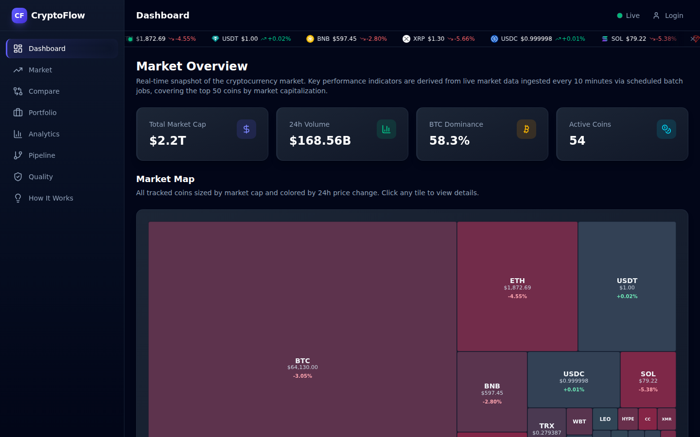
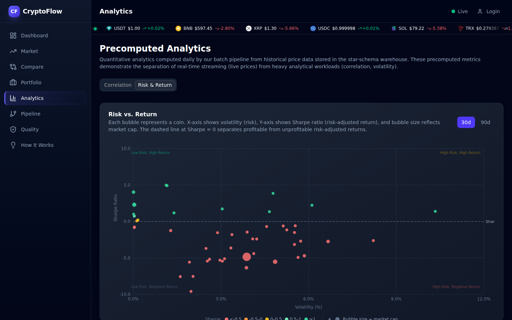
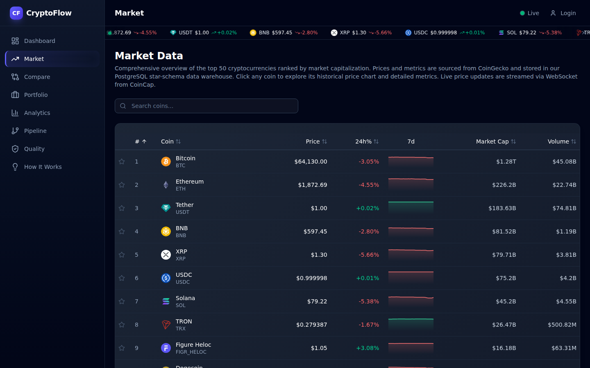
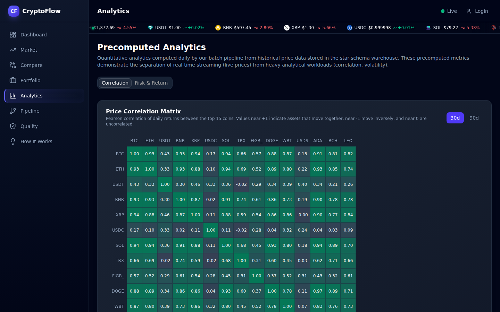
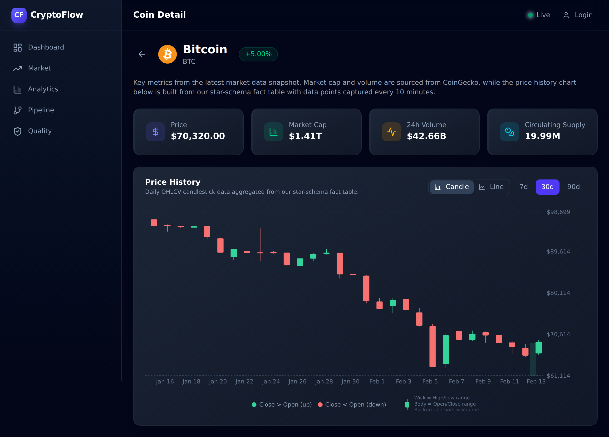
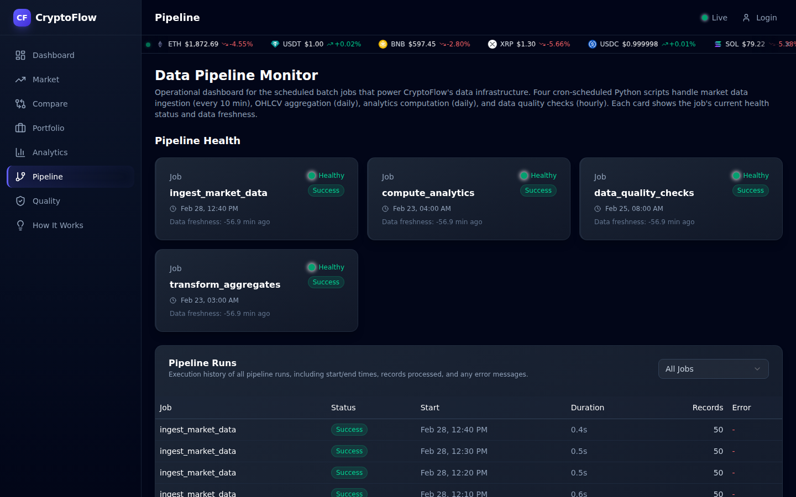
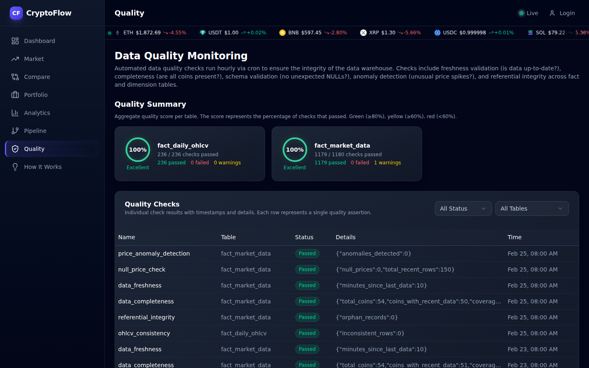

# CryptoFlow

**Real-Time Crypto Data Pipeline & Analytics Platform**

A full-stack application that ingests, processes, and visualizes cryptocurrency market data in real time. Built to demonstrate end-to-end data engineering and modern web development, from a star-schema data warehouse to interactive dashboards with live price streaming.

### [Live Demo →](https://cryptoflow.deka-labs.dev)





---

## What It Does

CryptoFlow tracks the top 50 cryptocurrencies by market cap and provides:

- **Real-time price streaming** via WebSocket (CoinCap → Redis Pub/Sub → Browser)
- **Batch data ingestion** from CoinGecko API every 10 minutes
- **Precomputed analytics**: correlation matrices, volatility metrics, and risk-return analysis, computed daily
- **Automated data quality monitoring** with freshness, completeness, and anomaly checks
- **Interactive visualizations**: candlestick charts, risk-return scatter plots, correlation heatmaps, market treemaps, and sortable tables

---

## Architecture

```
                         ┌─────────────────────────────────┐
                         │          DATA SOURCES            │
                         │                                  │
                         │  CoinGecko REST    CoinCap WS    │
                         │  (batch, /10min)   (real-time)   │
                         └───────┬──────────────┬───────────┘
                                 │              │
                   ┌─────────────┘              └──────────────┐
                   ▼                                           ▼
         ┌──────────────────┐                      ┌────────────────────┐
         │   Cron-Scheduled │                      │  Streaming         │
         │   Batch Jobs     │                      │  Consumer          │
         │                  │                      │                    │
         │  • Ingestion     │                      │  CoinCap WebSocket │
         │  • OHLCV Agg.    │                      │  → Redis Pub/Sub   │
         │  • Analytics     │                      │                    │
         │  • Quality Checks│                      └─────────┬──────────┘
         └────────┬─────────┘                                │
                  │                                          │
                  ▼                                          ▼
         ┌─────────────────────────────────────────────────────────────┐
         │                    PostgreSQL (Star Schema)                  │
         │                                                             │
         │   dim_coin  ←──  fact_market_data  ──→  dim_time            │
         │                  fact_daily_ohlcv                           │
         │                  analytics_correlation / volatility          │
         │                  mv_latest_market_data (materialized view)  │
         └──────────────────────────┬──────────────────────────────────┘
                                    │
                           ┌────────┴────────┐
                           ▼                 ▼
                 ┌──────────────┐   ┌──────────────────┐
                 │   FastAPI    │   │     Redis         │
                 │   REST API   │   │   Pub/Sub Cache   │
                 │   + WebSocket│◄──│                   │
                 └───────┬──────┘   └───────────────────┘
                         │
                         ▼
                 ┌──────────────────────┐
                 │    Next.js Frontend  │
                 │                      │
                 │  Dashboard · Market  │
                 │  Analytics · Pipeline│
                 │  Quality · Auth      │
                 └──────────────────────┘
```

---

## Tech Stack

| Layer | Technology |
|---|---|
| **Frontend** | Next.js 16, TypeScript, Tailwind CSS, shadcn/ui, Recharts |
| **Backend** | Python 3.12, FastAPI, SQLAlchemy 2.0, Alembic |
| **Database** | PostgreSQL 16 (Star Schema + Materialized Views) |
| **Cache / PubSub** | Redis 7 |
| **Scheduling** | Cron + standalone Python batch scripts |
| **Streaming** | CoinCap WebSocket → Redis Pub/Sub → FastAPI WebSocket → Browser |
| **Auth** | JWT (python-jose + passlib/bcrypt) |
| **Data Sources** | CoinGecko API (REST), CoinCap API (WebSocket) |

---

## Key Features

### Star Schema Data Warehouse

The PostgreSQL database uses a dimensional model with fact and dimension tables, the same approach used in production data warehouses. A materialized view (`mv_latest_market_data`) provides sub-millisecond dashboard queries.

### Batch Pipeline with Self-Monitoring

Four cron-scheduled Python scripts handle all batch processing. Every run is tracked in `pipeline_runs` with status, duration, and record counts, all visible in the Pipeline Monitor UI.

| Job | Schedule | What It Does |
|---|---|---|
| `ingest_market_data` | Every 10 min | Fetch top 50 coins, upsert dimensions, insert facts, refresh MV |
| `transform_aggregates` | Daily 03:00 | Compute daily OHLCV from raw 10-minute snapshots |
| `compute_analytics` | Daily 04:00 | Pearson correlation matrix (15×15) and volatility metrics |
| `data_quality_checks` | Hourly | Freshness, completeness, anomaly detection, referential integrity |

### Real-Time Streaming

A standalone WebSocket consumer connects to CoinCap, publishes price updates to Redis Pub/Sub, which the FastAPI backend relays to all connected browsers via WebSocket. Prices flash green/red on update.

### Data Quality Engineering

Six automated checks run hourly and feed the Quality dashboard with pass/fail/warning scores per table:

- **Freshness**: Is the latest data less than 30 minutes old?
- **Completeness**: Are all 50 tracked coins present in the last snapshot?
- **Schema validation**: No unexpected NULL prices?
- **Anomaly detection**: Price change >50% between consecutive snapshots?
- **Referential integrity**: All fact rows reference valid dimension records?
- **OHLCV consistency**: High >= Low, Close within expected range?

### Precomputed Analytics

Daily batch jobs compute Pearson correlation between the top 15 coins and volatility metrics (standard deviation, max drawdown, Sharpe ratio) for all tracked coins, demonstrating the batch vs. real-time tradeoff in data architecture.

### Interactive Chart Suite

Every chart includes inline color legends so users can interpret the data without prior knowledge:

- **Risk-Return Scatter**: Bubble chart mapping volatility (x) against Sharpe ratio (y), with bubble size encoding market cap. Five-tier Sharpe color scale, quadrant annotations, and a size legend.
- **Candlestick Chart**: Daily OHLCV candles with wick/body rendering and a translucent volume overlay. Includes a mini candle anatomy diagram explaining wicks, bodies, and volume bars.
- **Max Drawdown**: Horizontal bar chart of worst peak-to-trough declines, color-coded by severity across four tiers (mild to severe).
- **Volatility Ranking**: Bar chart of return standard deviations, color-coded by a three-tier risk scale (low, medium, high) relative to the highest value in the set.
- **Correlation Heatmap**: 15x15 matrix of Pearson correlations with a diverging color gradient.
- **Market Treemap**: Area-weighted tile map of market capitalization, colored by 24h price change.

---

## Screenshots

| Dashboard | Market Table |
|---|---|
|  |  |

| Correlation Heatmap | Risk & Return Analytics |
|---|---|
|  |  |

| Coin Detail (Candlestick) | Coin Detail (Line) |
|---|---|
|  |  |

| Pipeline Monitor | Data Quality |
|---|---|
|  |  |

---

## Project Structure

```
cryptoflow/
├── backend/                       # FastAPI application
│   ├── app/
│   │   ├── models/                # SQLAlchemy ORM (star schema)
│   │   ├── schemas/               # Pydantic request/response models
│   │   ├── routers/               # REST endpoints + WebSocket
│   │   ├── services/              # CoinGecko client, analytics
│   │   ├── auth/                  # JWT + password hashing
│   │   └── websocket/             # Connection manager
│   ├── alembic/                   # Database migrations
│   └── tests/
├── frontend/                      # Next.js application
│   └── src/
│       ├── app/                   # Pages (App Router)
│       ├── components/            # Charts, dashboard, market, layout
│       ├── hooks/                 # useLivePrices, useMarketData
│       ├── providers/             # WebSocket + Auth context
│       └── lib/                   # Typed API client, utilities
├── realtime/
│   └── consumer.py                # CoinCap WebSocket → Redis Pub/Sub
├── scripts/
│   ├── jobs/                      # Cron-scheduled batch jobs
│   │   ├── ingest_market_data.py
│   │   ├── transform_aggregates.py
│   │   ├── compute_analytics.py
│   │   └── data_quality_checks.py
│   ├── start.sh                   # Start all services
│   └── stop.sh                    # Stop all services
└── pipelines/
    └── dags/                      # Pipeline logic (reference DAGs)
```

---

## API

Interactive documentation available at [`/docs`](https://cryptoflow.deka-labs.dev/api/docs) (Swagger UI).

| Endpoint | Description |
|---|---|
| `GET /api/v1/coins` | Paginated coin list with current prices |
| `GET /api/v1/coins/{id}/history` | Historical prices (7d / 30d / 90d) |
| `GET /api/v1/coins/{id}/ohlcv` | Daily OHLCV candlestick data (1-365d) |
| `GET /api/v1/market/overview` | Market KPIs, top gainers & losers |
| `GET /api/v1/analytics/correlation` | Correlation matrix (30d / 90d) |
| `GET /api/v1/analytics/volatility` | Volatility ranking with Sharpe ratio |
| `GET /api/v1/pipeline/health` | Batch job health + data freshness |
| `GET /api/v1/quality/summary` | Quality scores per table |
| `WS  /api/v1/ws/prices` | Real-time price stream |

---

## Getting Started

```bash
# Prerequisites: PostgreSQL 16, Redis 7, Python 3.11+, Node.js 20+

# 1. Clone
git clone <repo-url> && cd cryptoflow

# 2. Backend
python3 -m venv .venv && source .venv/bin/activate
pip install -e "backend/.[dev]"
cd backend && alembic upgrade head && cd ..
python3 scripts/seed_data.py

# 3. Frontend
cd frontend && npm install && npm run build && cd ..

# 4. Start all services
./scripts/start.sh
```

Open `http://localhost:3000`. The dashboard loads with live data.

---

## Database Schema

```sql
-- Dimensions
dim_coin         (id, coingecko_id, symbol, name, image_url, market_cap_rank)
dim_time         (date, year, quarter, month, week, day_of_week, is_weekend)

-- Facts (10-minute snapshots + daily aggregates)
fact_market_data (coin_id, timestamp, price_usd, market_cap, volume, ...)
fact_daily_ohlcv (coin_id, date, open, high, low, close, volume)

-- Precomputed Analytics
analytics_correlation (coin_a_id, coin_b_id, period_days, correlation)
analytics_volatility  (coin_id, period_days, volatility, max_drawdown, sharpe_ratio)

-- Operational
pipeline_runs        (job_id, status, start_time, end_time, records_processed)
data_quality_checks  (check_name, table_name, status, details)

-- Performance
mv_latest_market_data  → materialized view for sub-ms dashboard queries
```
